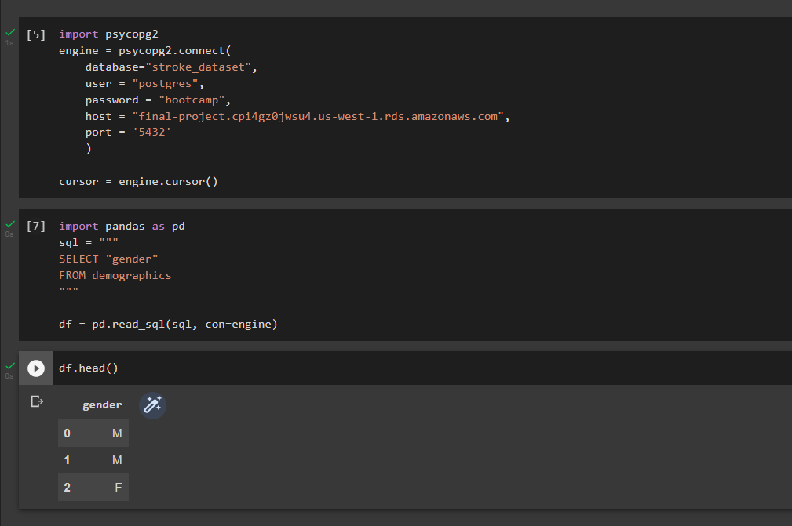

# Stroke Prediction — Final Project

### Team members:
- Janice Courtois
- Alex Norgren
- Tom Pankratz
- Rachel Rautenberg

### Selected topic
The goal of this project is to predict which factors may correlate (and possibly contribute) to higher stroke mortality rates within the United States, looking at any variances by region, state and county. Factors which we'll be exploring and training and testing through a machine learning model include:

Health-related factors:
- Smoking
- Obesity
- Access to healthy foods
- Access to exercise opportunities
- Primary care availability
- Availability of mental health providers

Social-related factors:
- College education
- Unemployment
- Income	
- Violent crime rate
- Air pollution
- Length and type of commute to work
- Urban vs. rural

### Reasons for selecting topic
All four team members work in health care at Mayo Clinic, so there was a desire to answer questions related to our industry. Also, several team members have family members who have had strokes, including a grandfather and a father, so the topic is personal as well and any insights gleaned will be helpful to better understand various factors that could lead to a stroke.

### Source data:

- Stroke Mortality Data Among US Adults (35+) by State/Territory and County (2018)
    - Data.gov
    - Publisher: Centers for Disease Control and Prevention
    - This dataset is intended for public access and use.
    - https://catalog.data.gov/dataset/stroke-mortality-data-among-us-adults-35-by-state-territory-and-county-2017-2019-d738a
- County Health Rankings (2018)
    - Countyhealthrankings.org
    - Publisher: University of Wisconsin Population Health Institute (Program: County Health Rankings & Roadmaps (CHR&R))
    - https://www.countyhealthrankings.org/explore-health-rankings/rankings-data-documentation/national-data-documentation-2010-2019

### Questions hoped to get answered:
To what extent do factors listed above correlate to higher stroke mortality rates? What differences can be uncovered by region, state and county?

## Technologies Used:

### Data Cleaning and Analysis
Pandas will be used to clean the data and perform an exploratory analysis. Further analysis will be completed using Python.

### Database Storage
PostgreSQL is the database we intend to use, connected to AWS.

### Machine Learning
SciKitLearn is the ML library we'll be using to create a classifier. Our training and testing setup is ___. [Extra ML verbiage will be added here].

### Dashboard
We intend to either integrate D3.js or use Tableau for a fully functioning and interactive dashboard displayed on a web page, highlighting results from the data and machine learning exercises. We also plan to include an interactive web form to gather user input to run through our machine learning module, using Flask and likely hosted on Heroku (still to be determined).

## Segment 1 Deliverables

### Summary
The team pivoted mid-week to change the approach to the project, including the sources for our data, and increase the amount of data we plan to run through a machine learning model. The "plumbing" has been set up with Python, PostgreSQL and AWS, and now the work begins to clean the data, merge and create final tables in the database, and then continue to test the machine learning model(s).

### Presentation
See above

### GitHub

- Communication protocol
    - The team is communicating regularly via the following tools:
        - Slack channel
        - Tuesday & Thursday class times, 7 pm CST
        - Daily touchpoints, 8:30 pm CST
- Each team member has created a GitHub branch
- Each team member has at least four commits

### Machine Learning Model

- A provisional machine learning model has been created (see very preliminary .ipynb draft file in respository)
    - It takes in data from the provisional database (PostgreSQL)
    - It outputs labels for input data

        

### Database

- A provisional database has been created (PostgreSQL)
    - Sample data has been added

        

    - A draft machine learning module is connected to the provisional database (see screenshot above within "Machine Learning Model" section)

