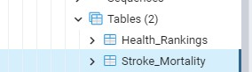

# Stroke Mortality Prediction — Final Project

--------------------------------

### Team members:

- Janice Courtois
- Alex Norgren
- Tom Pankratz
- Rachel Rautenberg

--------------------------------

### [Presentation slides (Google Slides)](https://docs.google.com/presentation/d/1E1D_wDwgtw-h_wREXM73hGIfPYEHObPIjhqgLeNW1OE/edit?usp=sharing)

[Presentation slides (PDF)](Resources/Stroke_Predictor_Google_Slides.pdf)

--------------------------------

### Selected topic

The goal of this project is to find out if we are able to predict which factors may correlate (and possibly contribute) to higher stroke mortality rates within the United States. Factors which we've explored, trained and tested through various machine learning models include:

Health-related factors:

- Smoking
- Obesity
- Access to healthy foods
- Access to exercise opportunities
- Primary care availability
- Availability of mental health providers

Social-related factors:

- College education
- Unemployment
- Income
- Violent crime rate
- Air pollution
- Length and type of commute to work
- Urban vs. rural

--------------------------------

### Reasons for selecting topic

All four team members work in health care at Mayo Clinic, so there was a desire to answer questions related to our industry. Also, several team members have family members who have had strokes, including a grandfather and a father, so the topic is personal as well and any insights gleaned will be helpful to better understand various factors that could lead to a stroke.

--------------------------------

### Questions hoped to get answered:

- Are we able to predict potential stroke mortality rates based on a set of health-related or social-related factors?
- Are there certain factors that are more important than others?

--------------------------------

### Description of data sources:

- **[Stroke Mortality Data Among US Adults (35+) by State/Territory and County (2018)](https://catalog.data.gov/dataset/stroke-mortality-data-among-us-adults-35-by-state-territory-and-county-2017-2019-d738a)**
  - Data.gov
  - Publisher: Centers for Disease Control and Prevention
  - This dataset is intended for public access and use.
- **[County Health Rankings (2018)](https://www.countyhealthrankings.org/explore-health-rankings/rankings-data-documentation/national-data-documentation-2010-2019)**
  - Countyhealthrankings.org
  - Publisher: University of Wisconsin Population Health Institute (Program: County Health Rankings & Roadmaps (CHR&R))

--------------------------------

### Description of the data exploration phase of the project:

- Once our team determined that stroke mortality rates by counties within the United States was to be our target dataset, we brainstormed on possible health-related and social-related factors to research that may correlate (and possibly contribute) to higher stroke mortality rates within the United States. 
- We did a lot of Google searches on random factors such as average days of sunlight per year, amount of drug use, number of fitness facilities per capita, number of restaurants per capita, and many more. 
- After an extensive search, we identified the original datasets from the two sources mentioned above, with the first containing the target data, and the second containing data to be used for the features.

--------------------------------

### Description of the analysis phase of the project:

- PostgreSQL was used for data storage and merging, connected to AWS via pgAdmin 4.

  

- The database interfaced with the project, and contained at least two tables. [See Python file that shows the connection.](https://github.com/Norgs87/Final-Project-Stroke-Prediction/blob/main/RFR_ML_DB_Connect.ipynb)

  

- The tables were joined using the database language (not including any joins in Pandas).

  

- SQLAlchemy psycopg2 was used as the connection string, [as shown in this file](https://github.com/Norgs87/Final-Project-Stroke-Prediction/blob/main/RFR_ML_DB_Connect.ipynb).

- The following ERD shows the relationships.

  

--------------------------------

### Machine Learning Model

**Description of preliminary data preprocessing**

Python Pandas was used to clean the data and perform an exploratory analysis, and further analysis was performed using Python.

- Stroke mortality dataset:
  - This dataset was less extensive, but required quite a bit of cleaning and pre-processing. 
  - Python was used, using Pandas and Numpy, and [here's the Python file](https://github.com/Norgs87/Final-Project-Stroke-Prediction/blob/main/Models%20Practice%20%26%20Cleaning%20Code/Stroke_Mortality_Cleaned.ipynb). 
  - The original dataset had 59,094 rows and 20 columns. 
  - We knew that the county ID (or FIPS) would be the common primary key in the PostgreSQL database, and thus needed to clean the data down to 3,142 rows, or the number of counties within the United States. Non-beneficial columns were dropped. Column names were renamed for clarity. Columns with additional data not needed were filtered out. Extra regions were removed, such as Puerto Rico, Guam and more. Finally, extra values not neeeded were dropped, reducing the total number of rows to the needed 3,142, and to only include 2 columns: The FIPS (primary key) and the stroke mortality rate by county.
- Health rankings dataset:
  - This dataset, which includes social factors, was more extensive and also required a fair amount of preprocessing. Python was again used, along with Pandas and Numpy, and [here's the Python file](https://github.com/Norgs87/Final-Project-Stroke-Prediction/blob/main/Models%20Practice%20%26%20Cleaning%20Code/Health_Rankings_Cleaned.ipynb). 
  - The file initially contained 3,143 rows and 166 columns. 
  - The team spent a considerable amount of time selecting which factors to use as the features for the machine learning models, hypothesizing which ones could have the biggest influence on stroke mortality rates across the United States.
  - The team finally chose 13 total, with 6 health-related and 7 social or environment-related.
  - The job then began to preprocess the data down to only what was needed. To start, unwanted columns were dropped. The remaining columns were renamed for consistency. 
  - Another dataset was discovered a day later, showing percent urban vs. rural for each county, so it was loaded and then merged with the main dataset, using Pandas. 
  - Colums were then rearranged in preparation to merge with the other dataset in the PostgreSQL database.

**Description of preliminary feature engineering and preliminary feature selection, including the decision-making process**

  - The target was easily identifiable as the team sought to develop a machine learning model that provided a stroke mortality prediction. With the datasets that we chose to use, there were three [similar] models as we worked through understanding what the best predictors were for an individual. 
  - We built a machine learning model, using SciKitLearn's RandomForestRegressor, against all applicable features of the dataset. 
  - We copied and edited the working model two times:
    - The first time to run the model against health related features such as smoker or obesity
    - The second time to run the model against the environmental /
    economic features that were included, such as air quality or unemployment. 
    - A fourth model was run against the features that were identified as top
    importances. This model was not considered as the final machine learning model, but instead used as a support tool to view metrics with just these features. We understood the risk of overfitting by reducing to only the features of importance, so this fourth model was more used for interest than final use.

**Description of how data was split into training and testing sets**

- Training and testing sets were split using the default parameters.
- An explanation of model choice, including limitations and benefits (model base research), [can be found here](https://community.alteryx.com/t5/Data-Science/Predictive-Process-Step-1-Finding-Your-Target-Variable/ba-p/401639).
- The first model attempted was Spline. Because our team chose to work with a continuous target rather than binary, we did some research on model options that may apply. This model was working well in practice / learning, however we ran in to our first challenge when finding no clear path for using the the multiple features that we wanted to include for use in our dataset.
- The second model attempted was the MARS. Practice modeling with a single feature went smoothly, however we quickly recognized the limitations of this model were similar to that of Spline. While we could run multiple features using MARS, having 13 features would be difficult to interpret in the model due to the complexity in the 3D modeling.
- Following in class discussion, we then moved to exploring convulutional neural network and random forest regressor modeling. At this time CNN did not move foward as a model to use due to high usage for image data which we are not working with.
- The machine learning model that we decided to use was SciKitLearn's RandomForestRegressor. We went with this model because it worked well with the number of features we were using and the target that we identified was continuous rather than binary.
- A GridSearchCV was run in an effort to optimize our model.  We updated the parameters to test, however this did not result in significant gains for the accuracy of our model so we reverted to original parameters, resulting in no major changes for segment three.  We did however convert repetitive code in to functions. 

**Description of accuracy metric**

- When using the RandomForestRegression model the accuracy metric to use for validation is the RMSE, Root Mean Square Error.  The rule of thumb for RMSE is that a value between 0.2 to 0.5 is pretty accurately able to predict the data. Generally the lower the RMSE the better fit, however RMSE values lower than 0.2 would also suggest an overfit model.
- The RMSE value for our three models is 12.13 for the full dataset, 13.12 for the health only features, and 13.21 for the economic / environmental features. We recognized that this value suggested that our model was not very accurate.  Discussion lead us to believe that the lack of accuracy of our model was very likely due to the unique features we chose to use in our data. Ultimately the data features we were working with are not likely to predict stroke mortality. 
--------------------------------

### Dashboard

- A dashboard is created and includes all of the following:

    - An interactive web site was created and is hosted on heroku.com. It includes a dashboard built in Tableau, highlighting features data via United States maps.

    - The web site also includes an interactive form, built with Flask. It allows users to enter data for the chosen features/factors and uses the Random Forest Regressor maching learning model to predict stroke mortality rates based on that input data. **Web site link coming soon.**

      

--------------------------------

## Technologies, languages, tools, and algorithms used throughout the project

- GitHub
- Bash/Terminal
- Python (including Pandas, Numpy, MatPlotLib, Pickle, etc.)
- SciKitLearn & other machine learning models
- Google Colab
- Jupyter Notebook
- PostgreSQL, PG Admin 4
- AWS (Amazon Web Services)
- Flask
- HTML
- CSS
- Heroku
- Chrome developer tools
- Slack
- Zoom

--------------------------------

## Segment 3 Deliverables (June 5)

### Presentation

- The presentation outlines the project, including the following:
  - ~~Selected topic~~
  - ~~Reason topic was selected~~
  - ~~Description of the source of data~~
  - ~~Questions the team hopes to answer with the data~~
  - ~~Description of the data exploration phase of the project~~
  - ~~Description of the analysis phase of the project~~
  - ~~Technologies, languages, tools, and algorithms used throughout the project~~

- Slides
  - ~~Presentations are drafted in Google Slides~~.

### GitHub

- Main Branch
    - ~~All code in the main branch is production ready~~
    - ~~All code necessary to perform exploratory analysis~~
    - ~~Most code necessary to complete the machine learning portion of project~~
- README.md
  - README.md should include:
    - ~~Description of the communication protocols has been removed~~
    - ~~Cohesive, structured outline of the project (this may include images, but should be easy to follow and digest)~~
    - ~~Link to Google Slides draft presentation~~

- Individual Branches
  - ~~At least one branch for each team member~~
  - Each team member has at least four commits for the duration of the third segment (12 total commits per person)

### Machine Learning Model

Team members submit the working code for their machine learning model, as well as the
following:

- ~~Description of data preprocessing~~
- ~~Description of feature engineering and the feature selection, including their decisionmaking process~~
- ~~Description of how data was split into training and testing sets~~
- ~~Explanation of changes in model choice (if changes occurred between te Segment 2 and Segment 3 deliverables)~~
- ~~Description of how they have trained the model thus far, and any additional training
  that will take place~~
- ~~Description of current accuracy score~~

~~Additionally, the model obviously addresses the question or problem the team is solving.~~

### Dashboard

The dashboard presents a data story that is logical and easy to follow for someone
unfamiliar with the topic. It includes all of the following:

- ~~Images from the initial analysis~~
- ~~Data (images or report) from the machine learning task~~
- ~~At least one interactive element~~

--------------------------------

